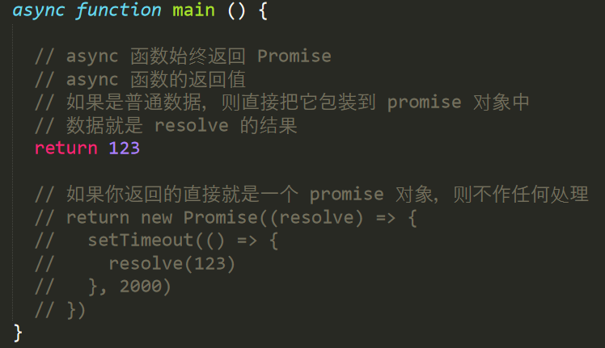
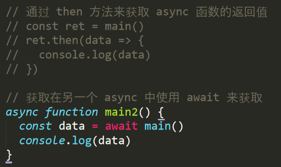

# `Promise`对象；

>  概念：`Promise`是一个对象，它代表了一个异步操作的最终完成或者失败。 

```
1、Promise 是 ECMAScript6 新增的一个构造函数；
2、本质上，Promise 是一个被某些函数传出的对象，我们附加回调函数（callback）使用它，而不是将回	调函数传入那些函数内部。
```

1. 创建promise对象；

   - 参数：fn(resolve,reject) { 异步代码 }
   - 方法1：`.then(resolve,reject)`;
      - 参数1：`resolve`函数;
      - 参数2：`reject`函数；接收处理异常；
   - 方法2：`.catch(err => {})`
     - 用来接收处理异常；
   - **只有**`promise`才有`.then`方法；
   
   ```js
   // 创建一个promise对象；
   const p1 = new Promise((resolve, reject) => {
    // 2、在函数中执行一个异步操作
     setTimeout(() => {
       // console.log(1)
       // resolve() 成功
       // reject()  失败
     }, 1000)
   })
   // 通过 then 方法注册：resolve，reject 函数
   // 参数1：注册 resolve 函数
   // 参数2（可选的）：注册 reject 函数
    p1.then(() => {
      console.log('定时器执行结束了')
    }, () => {
      console.log('发生异常了')
    })
   ```
   

> 1、then 方法之后可以继续 then，原因是 then 方法执行完以后会返回一个新的 Promise 对象；
>
> 2、如果是普通数据，那么它会把该数据包装为那个返回的 Promise 的 resolve 结果；
>
> ```js
>   return new Promise((resolve) => {
>       resolve('hello')
>     })
>   return 'hello'
> ```
>
> 3、如果你返回的数据就是一个 Promise 对象，那它就不做任何处理了

# `async`函数；

> 介绍：Async 函数简化了 Promise 的调用，本质还是 Promise

## `async`函数的基本用法;

```js
// 任何函数都可以被标记为 async 函数
    // 具名函数：async function main() {
    // 匿名函数：async function () {}
    // 箭头函数：async () => {}
    // 对象函数成员简写：

    // const user = {
    //   sayHello: async function () {}
    //   async sayHello () {}
    //   sayHello: async () => {}
    // }

 async function main() {
      // await 简化了获取 promise 结果
      // 注意：await 只能在被标记了 async 的函数中使用
      // const data = await request('http://jsonplaceholder.typicode.com/posts')
      // await 后面跟 promise才有意义
      // const a = await 123
      // console.log(a)
    }
```


## 返回`Promise`对象;

1.  async 函数始终返回 Promise
2. async 函数的返回值;
   1. 如果是普通数据，则直接把它包装到 promise 对象中
   2. 数据就是 resolve 的结果
      - return 123
   3. 如果你返回的直接就是一个 promise 对象，则不作任何处理。



1. 通过 then 方法来获取 async 函数的返回值。
2. 或者在另一个 async 中使用 await 来获取。



- **异常处理；**

  - 还是使用 .catch 来处理异常；
  - 更推荐使用 try-catch 来捕获异常。

  ```js
  async function main() {
        // 还是使用 .catch 来处理异常
         const data = await request('dsanlksas')
           .catch(err => {
             console.log('请求失败了')
           })
        // console.log(data)
  
        // 更推荐使用 try-catch 来捕获异常
        try {
          // try 捕获不到它的异常
          // request('dsabjdsdsa').then(data => {
          //   console.log(data)
          // })
          // JSON.parse('dnsakdnsa')
        } catch (err) {
          console.log('请求失败了', err)
        }
      }
  
  main()
  ```

  


## `await`命令;

## `async`函数的实现原理;

# `Vuex`

> 概念：

## 安装；

1.  在`Vue`之后引入`vuex`会进行自动安装： 

   ```js
   <script src="/path/to/vue.js"></script>
   <script src="/path/to/vuex.js"></script>
   ```

2. `NPM`;

   ```bash
   npm install vuex --save
   ```

3. `Yarn`;

   ```bash
   yarn add vuex
   ```

4. ` 在一个模块化的打包系统中，您必须显式地通过 `Vue.use()` 来安装 Vuex： `

   ```vue
   import Vue from 'vue'
   import Vuex from 'vuex'
   
   Vue.use(Vuex)
   ```

>  注：当使用全局 script 标签引用`Vuex`时，不需要以上安装过程 。

### 

------

# 小节；

---

1. 当你需要在修改数据之后立即操作`DOM`，最好放到`$nextTick`中；
2. 这个函数会在本次的数据影响视图更新之后被调用，其中的代码拿到的`DOM`一定是更新之后的

```js
this.$nextTick(() => {
    console.log(this.$refs.message.innerHTML)
})
```


