# JS知识总结:

## day1:

### 输入和输出：

- prompt("请输入您的银行卡密码：");  引导信息；
- alert('你真好看');  弹出框；
- console.log("控制台输出的信息");
- document.write("<h1>页面中输出123</h1>");  可以识别html标签；

### 变量的命名规范：

- 变量以字母、数字、下划线、$符号组成；
- 变量名字不能用数字作为开头、不能使用关键字或保留字；
- 变量名字是区分大小写的；

### 数据类型：

- 简单数类型：numder(NaN)数字类型、string(字符串类型)、Boolean(布尔类型)、undefined、Null、
- 复杂数据类型：Object(对象)
- NaN：即非数值（Not a Numder) 是一种特殊的number类型值；任何和NaN运算的结果都为NaN;和自己也不相等；

### 数据类型的相互转换：

#### 其他类型转数字类型：

- typeof 用来检测数据类型；

- Number();    较为严格；
  -  一定可以转出数字类型；
  - 字符串转数字：字符串中有一个不是数字字符则为NaN；
  -  Boolean(布尔类型)：NaN；
  - undefined: NaN；
  - Null：0；
- parseInt();  转整数：
  - 字符串转整数:只要在字符串中，数字前面没有非数字字符，那么都可以将非数字前面的所有数转出整数，
     否则为NaN；
  -  Boolean(布尔类型)：NaN；
  - undefined: NaN；
  - NaN:  NaN;
  - Null：NaN；
- parseFloat();  转浮点数；

### 操作符：

## day2:

### 分支语句：

- 判断的是布尔类型（隐式转换）；

```js
if (/* 条件表达式 */) {
  // 执行语句
}

if (/* 条件表达式 */){
  // 成立执行语句
} else {
  // 否则执行语句
}

if (/* 条件1 */){
  // 成立执行语句
} else if (/* 条件2 */){
  // 成立执行语句
} else if (/* 条件3 */){
  // 成立执行语句
} else {
  // 最后默认执行语句
}
```

### 三元表达式：

- 三元表达的可以说是if.....else语法的一种简化写法；

- ```html
  <!DOCTYPE html>
  <html lang="en">
  <head>
      <meta charset="UTF-8">
      <title>Document</title>
  </head>
  <body>
      <script>
          var a = 10;
          var b = 20;
          //三元表达式：
          var c = a = b ? a : b;
          console.log(c); //10
      </script>
  </body>
  </html>
  ```

### switch语句：

- 判断结果和常量1进行比较，若成立则执行里面的代码；所不成立则继续和常量2比较，若成立则执行里面的代码....
- switch语句的判断是**严格模式（全等比较）**；
- break可以省略，若是省略则代码会继续向下执行；

```js
switch (expression) {
  case 常量1:
    语句;
    break;
  case 常量2:
    语句;
    break;
  case 常量3:
    语句;
    break;
  …
  case 常量n:
    语句;
    break;
  default:
    语句;
    break;
}
```


## day3：

### 知识点总结：

- ```js
  //注意用  ` 包裹；用 ${} 包裹变量、函数、运算符；可以进行简单的运算，和函数的运行；
  alert(`${year}-${month}-${day} ${hour}-${minute}-${second}`); 
  ```

  ​      

### 清空数组：

- 重点： arr.length = 0;可以用于清空数组；

```html
<!doctype html>
<html lang="en">
<head>
    <meta charset="UTF-8">
    <meta http-equiv="X-UA-Compatible" content="ie=edge">
    <title>Document</title>
</head>
<body>
    <script>
        var arr = [1, 1, 1, 1];
        console.log(arr.length);
         // 清空数组
        arr.length = 0;
        console.log(arr);
        
        // 字面量的方式创建数组有一个情况：只有一个数据
      	var arr_1 = [90];
      	console.log(arr_1);
		//构造函数的方式创建数组，如果只有一个数据，则表示长度为90的空数组；
      	var arr_2 = new Array(90); // 长度为90的空数组；
      	console.log(arr_2);
    </script>
</body>
</html>
```

### 注意问题：


### 求数组中的最大值：
- 定义一个变量（假设为最大值）用于做比较；
```html
<!DOCTYPE html>
<html lang="en">
<head>
    <meta charset="UTF-8">
    <meta name="viewport" content="width=device-width, initial-scale=1.0">
    <meta http-equiv="X-UA-Compatible" content="ie=edge">
    <title>Document</title>
</head>
<body>
    <script>
        var arr = [1, 28, 3, 4, 10, 6, 7, 8, 9];
        // 声明一个变量假设第一个为最大值；
        var max = arr[0];
        for (var i = 1; i < arr.length - 1; i++) {
            // 每次循环都让max做比较；
            // 如果假设的最大值（max）小于某个数，则把它从新赋值给max；
            // 如果判断不成立则继续下一次循环直到和所有的数字比较完毕；
            
            // 不能写成arr[0]<arr[i];因为会被替换掉；要把arr[0]赋值给变量；
            
            // 变量max只是改变了指向，arr[0]的值没有被替换；
            if (max < arr[i]) {
                max = arr[i]
            }
        }
        console.log(max);
    </script>
</body>
</html>
```
### 求数组中的最小值：
```html
<!DOCTYPE html>
<html lang="en">
<head>
    <meta charset="UTF-8">
    <meta name="viewport" content="width=device-width, initial-scale=1.0">
    <meta http-equiv="X-UA-Compatible" content="ie=edge">
    <title>Document</title>
</head>
<body>
    <script>
        var arr = [12, 18, 14, 4, 5, 6, 7, 8, 9, 1];
        var min = arr[0];
        var a;
        for (var i = 0; i < arr.length; i++) {
            if (min > arr[i]) {
                min = arr[i];
            }
        }
        console.log(min);
    </script>
</body>
</html>
```

### 求数组的平均值：

-  注意：此时的sum不能只声明不赋值；
-  平均值的结果不能放在循环里面，因为每次都会除一次。

```html
<!DOCTYPE html>
<html lang="en">
<head>
    <meta charset="UTF-8">
    <meta name="viewport" content="width=device-width, initial-scale=1.0">
    <meta http-equiv="X-UA-Compatible" content="ie=edge">
    <title>Document</title>
</head>
<body>
    <script>
        var arr = [1, 1, 1];
        //注意此时的sum不能只声明不赋值；
        var sum = 0;
        for (var i = 0; i < arr.length; i++) {
            sum += arr[i];
            //jun = sum / arr.length;===不正确！！！
        }
        // 平均值的结果不能放在循环里面，因为每次都会除一次。！！！
        // 之所以打印的结果是正确的，是因为最后一次是用和相除得到的结果；
        // 所以要放在循环外面，
        //定义一个变量用于接收平均值；
        var jun = sum / arr.length;
        console.log(jun);
    </script>
</body>
</html>
```

### 求数组中相同元素的次数：

```js
<script>
    var arr = ["c", "a", "z", "a", 'c',"x", "a"];
    //定义：一个空对象用于存放键和值；
    var obj = {};
    //循环遍历数组；
    for (var i = 0; i < arr.length; i++) {
        // 把当前循环的元素赋值给变量用于判断；
        var item = arr[i];
        /*判断对象中是否有当前元素（键）；
        * 若没有则存到对象中并赋值为1，
        * 若有则在原来的基础上（值）上加1；
        * */
        if (obj[item]) {
            obj[item] = obj[item] + 1;
        } else {
            obj[item] = 1;
        }
    }
    console.log(obj);
</script>
```


### 求数组最大值的下标：

```html
<!DOCTYPE html>
<html lang="en">
<head>
    <meta charset="UTF-8">
    <meta name="viewport" content="width=device-width, initial-scale=1.0">
    <meta http-equiv="X-UA-Compatible" content="ie=edge">
    <title>Document</title>
</head>
<body>
    <script>
        var arr = [12, 18, 14, 0, 5, 6, 7, 8, 9, 1];
        // 声明一个变量用于存放下标；
        var a;
        //假设Max是最大值，则对应的i便是最大值的下标；
        var max = arr[0];
        for (var i = 0; i < arr.length; i++) {
            if (max < arr[i]) {
                max = arr[i];
                /* 只要进入这个判断就说明当前
                   的这个i是这个max的下标；
                   那就把i赋值给a；
                */
                a = i;
            }
        }
        console.log(max, a);
    </script>
</body>
</html>
```

### 根据用户的输入，求一组数中的和：

- 重点：字符串的分割；数字类型的转换；
- 需注意：分割后得到的是数组；但此时还是字符串；需要转换；

```html
<!DOCTYPE html>
<html lang="en">
<head>
    <meta charset="UTF-8">
    <meta name="viewport" content="width=device-width, initial-scale=1.0">
    <meta http-equiv="X-UA-Compatible" content="ie=edge">
    <title>Document</title>
</head>
<body>
    <script>
        // 定义变量获取用户的输入；
        var asus = prompt('请输入一组数字例：1，2，3');
        // 分割：因为我们得到的是字符串；
        // 分割后得到的是数组；但此时还是字符串；需要转换
        var arr = asus.split('，')
        // 遍历数组；
        // 定义变量用于求和；初始和为0；
        var sum = 0;
        for (var i = 0; i < arr.length; i++) {
            // 获取每个字符串，并转换
            var nam = parseFloat(arr[i]);
            sum += nam;
        }
        alert('和为：' + sum);
    </script>
</body>
</html>
```

### 冒泡排序：

- 第一步：找规律：
- 第二部：理解每个数字的比较的过程；
- 第三步：要熟练运用第三方变量的交换理念；

```html
<!DOCTYPE html>
<html lang="en">
<head>
    <meta charset="UTF-8">
    <meta name="viewport" content="width=device-width, initial-scale=1.0">
    <meta http-equiv="X-UA-Compatible" content="ie=edge">
    <title>Document</title>
</head>
<body>
    <script>
        // 需求: 一组数据实现从小到大或从大到少排列；
        var arr = [2, 4, 16, 6, 21, 8, 9, 0];
        //分析：
        /* 因为每个数字都要进行一次的比较；
           而比较过的数字在下一轮不需要进行比较了；
           所以一共比较arr.length - 1轮次；
           而每个数字则比较arr.length-i次；
         */
        //  外循环控制比较的轮次；
        for (var i = 1; i <= arr.length - 1; i++) {
            // 内循环控制每个数字比较的次数；
            for (var j = 0; j < arr.length - i; j++) {
                // 如果成立则进入判断；若不成立则进入下一次循环；
                if (arr[j] > arr[j + 1]) {
                    // 第三方变量用于存放待交换的数据；
                    // 原理就是arr[j+1]的数据暂时赋值给a，
                    // 然后arr[j]的数据赋值给arr[j+1]，
                    // 此时的结果是arr[j+1]和arr[j]的结果相同，
                    // 然后把暂时存在a里面的数据从新赋值给arr[j]；
                    // 此时便实现了交换；
                    var a = arr[j + 1];
                    arr[j + 1] = arr[j];
                    arr[j] = a;
                }
            }
        }
        console.log(arr);
    </script>
</body>
</html>
```

### 微软小娜：

```html
<!DOCTYPE html>
<html lang="en">
<head>
    <meta charset="UTF-8">
    <meta name="viewport" content="width=device-width, initial-scale=1.0">
    <meta http-equiv="X-UA-Compatible" content="ie=edge">
    <title>Document</title>
</head>
<body>
    <script>
        // 微软小娜
        // 需求：
        // 输入Q：完全退出；
        // 输入1：求一组数据的和；
        // 输入2：获取时间；
        // 输入3：随机讲一个笑话；

        // 分析：
        // 第一步需要无限循环，一直弹窗等待输入；
        while (true) {
            /* 因为根据用户输入的不同会有不同的功能，
               所以需要定义一个变量接受用户输入的信息；
             */
            //  \n 为转义字符换行；
            var w = prompt(' 请根据提示输入相关的数字：\n输入Q: 完全退出;\n输入1: 求一组数据的和;\n输入2: 获取时间;\n输入3: 随机讲一个笑话;')
                /* 判断用户输入的信息，若输入的是Q则退出整个循环；
                   输入其它数字则进入其他功能的判断；
                */
            
            
            // 输入Q：完全退出；
            if (w == 'Q') {
                alert('你不爱小娜了吗？');
                // 中断当前所在循环体；下面代码不执行
                break;
            }
            
            // 输入1：求一组数据的和；
            else if (w == 1) {
                /* 因为需要求和，所以需要接受到用户输入的信息 */
                var ar = prompt('请输入一组数字中间以逗号隔开\n例：1,2,3');
                /* 因为接受到的是字符串，所以需要分割成单个状态，
                   数组名.split('分隔符')；
                 */
                var arr = ar.split(',');
                /* 因为我们需要拿到每个数字，所以需要遍历数组 */
                var sum = 0; //用于求和；
                for (var i = 0; i < arr.length; i++) {
                    /* 虽然上面已经分割过，但是依然是字符串状态，
                       需要进行转换为number类型。用户可能输入小数!!!
                     */
                    sum += parseFloat(arr[i]);
                }
                // 当前循环结束，弹窗提示；
                alert('和为：' + sum);
            } else if (w == '2') {
                var date = new Date(); //创建对象
                var year = date.getUTCFullYear(); //获取年份
                var month = date.getMonth(); //获取月份
                month += 1
                // 如果月份小于10，则在前面加上0；
                // 虽然拼接后依然是字符串，但是双引号("")浏览器不显示；后台也不打印；
                // 若数组里面存的是字符串则弹窗不显示双引号；后台打印显示双引号；
                if (month < 10) {
                    month = '0' + month
                }
                var day = date.getUTCDate(); //获取天
                var hour = date.getHours(); //获取小时
                var minute = date.getMinutes(); // 获取分钟
                var second = date.getSeconds(); // 获取秒数
                // 如果秒数小于10，则在前面加上0；
                if (second < 10) {
                    second = '0' + second;
                }
                // es6的字符串拼接方法===模板字符串
                // 注意用 ` 包裹；用 ${} 包裹变量、函数、运算符；可以进行简单的运算，和函数的运行；
                alert(`${year}-${month}-${day} ${hour}-${minute}-${second}`)
            }
            // 随机产生一个笑话 
            else if (w == '3') {
                // 定义一个数组；
                var arr = [
                    '第一只羊',
                    '第二只羊',
                    '第三只羊',
                    '第四只羊',
                    '第五只羊',
                    '第六只羊',
                    '第七只羊',
                    '第八只羊',
                    '第九只羊',
                    '第十只羊',
                ];
                // 因为要随机产生一个笑话，所以要用到随机数；
                /* 因为数组的长度为arr.length,
                   所以随机数的范围是0--arr.length;
                   又因为产生的随机数有小数，所以要取整；
                   Math.floor();===下取整；
                 */
                var sui = Math.floor(Math.random() * arr.length);
                alert(arr[sui]);
            }
            // 如果前面的都不成立则执行下面的代码；
            else {
                alert('小娜还小，听不懂你说的是什么，请从新输入')
            }
        }
    </script>
</body>
</html>
```

## day4:

### 知识点小节：

- 函数的调用若要拿到值则要有返回值；
- 返回值可以修改；若后面有值，则返回，若没有值；默认是undefined；
- 函数的调用或方法的调用若不给返回值则打印undefined;
- return中止函数的执行；在函数的执行过程中若遇到return则立即跳出函数体；

### 形参和实参：

* <b>若函数定义了形参并且参与了运算，那么函数的调用就要传入实参；否则打印NaN;</b>

* 形参没有赋值和变量一样为undefined;

  ```html
  <!DOCTYPE html>
  <html lang="en">
  
  <head>
      <meta charset="UTF-8">
      <title>Document</title>
  </head>
  
  <body>
  <script>
  //第一种情况    
      function f1(a) {
          var b=8+a;
          console.log(b)
      }
      f1();//NaN
      
      //第二种情况：
       function f1(a) {
          // var b=8+a;
          console.log(a);
      }
      f1();//undefined
  </script>
  </body>
  </html>
  ```

### arguments伪数组：

- arguments伪数组:可以获取所有实参的对象，<b>函数内部的变量（不是我们声明的，也不需要我们声明）</b>;
- 有下标，有长度，可遍历；
- 应用场景：当我们不知道我们的参数个数的时候；

```html
<!DOCTYPE html>
<html lang="en">
<head>
    <meta charset="UTF-8">
    <meta name="viewport" content="width=device-width, initial-scale=1.0">
    <meta http-equiv="X-UA-Compatible" content="ie=edge">
    <title>Document</title>
</head>
<body>
    <script>
        function f1() {
            console.log(arguments.length);
            var sum = 0;
            for (var i = 0; i < arguments.length; i++) {
                // var sum = 0; 不能写在这里，因为每次循环都会被重新赋值给覆盖掉；
                sum += arguments[i];
            }
            console.log(sum);
            return sum;
        }
        f1(1, 2, 3, 4, 5, 6, 7, 8, 9)
    </script>
</body>
</html>
```

### 匿名函数：

- 匿名函数：没有名字的函数，但是在js的语法中，是不允许匿名函数单独存在的，要配合其它语法使用；

- 匿名函数的自调用，加载页面后，自动执行一个函数；

- 也可以称为：**沙箱**；

  - 防止全局变量被污染；
  - 沙箱不能主动去影响外部的世界；为保证沙箱的封闭；
    - 需要传入实参：window;
    - 定义形参接收window;
    - 形参可以该名字，全局变量window不能改名字；
  
```js
  // 定义之后，立刻调用，输出10
  (function(){  
    console.log(10);  
  })();
```

  

### 回调函数：

- 函数也是数据类型，也可以作为别的函数的参数；

  ```html
  <!DOCTYPE html>
  <html lang="en">
  <head>
      <meta charset="UTF-8">
      <meta name="viewport" content="width=device-width, initial-scale=1.0">
      <meta http-equiv="X-UA-Compatible" content="ie=edge">
      <title>Document</title>
  </head>
  <body>
      <script>
          // fn 只不过在函数内部是一个形参，内部变量；
          function f1(a, fn) {
              console.log(a); //10；
              // 函数的调用，在函数名的后面加括号；
              // 这样，把函数作为实参传入，传入的函数对外面函数的调用叫回调函数；
              fn();
          }
  
          function f2() {
              console.log('f2函数执行了'); //f2函数执行了
          }
          f1(10, f2); // 输出 10 和 'f2函数执行了' f2是f1的回调函数；
      </script>
  </body>
  </html>
  ```

### 作用域：

- 全局变量：在全局作用域下用var声明的变量是全局变量；全局变量任何地方都可以访问的；

- 隐式全局变量：不使用var声明的变量；
  - 全局变量不能删除；
  - 隐式全局变量可以删除；

- 局部变量：在局部作用域下声明的变量是局部变量；

- 全局作用域：全局变量的生效范围区域；

- 局部作用域：局部变量的生效范围区域；

  ```
  局部变量退出作用域之后会销毁，全局变量关闭网页或浏览器才会销毁；
  在es5之前没有块级作用域的的概念,只有函数作用域**，
  ```


### 作用域链：

- ```
  只有函数可以制造作用域结构， 那么只要是代码，就至少有一个作用域, 即全局作用域。凡是代码中有函数，那么这个函数就构成另一个作用域。如果函数中还有函数，那么在这个作用域中就又可以诞生一个作用域。
  
  将这样的所有的作用域列出来，可以有一个结构: 函数内指向函数外的链式结构。就称作作用域链。
  ```


### 预解析：

- 在代码执行的过程中，js引擎会进行预解析；

  - 预解析时，变量声明在前，函数声明在后；

    - <b>在函数名和var变量名冲突的时候，预解析会舍弃var声明的变量；</b>
    - 原因：后来者居上；
    - <b>在函数的名字和变量的名字相同的时候，若a函数的调用顺序在变量下面则会报错；</b>

    

    

  - <b>只能预解析用var声明的变量，没有用var声明的变量（隐式全局变量）不会被解析；</b>

  - 预解析会把用var声明的变量，提到当前作用域的最顶端（只是声明提前）；

  - 预解析会把函数声明，提到当前作用域的最顶端（只是声明提前）；

    ```js
       // 观察下面的代码，说出执行结果
        var num = 10;
        fun();
        console.log(num);
    
        function fun() {
            console.log(num);
            var num = 20;
        }
    
    //结果：  undefined   10
    
    	function fun() {
            console.log(num);
        }
        var num = 10;
        fun();
        console.log(num);
    //结果：  10   10
    
    	 var num = 10;
        fun();
        console.log(num);
    
        function fun() {
            console.log(num);
            num = 20;
        }
    //结果：  10   20
    
    
     function f1() {
            console.log(num)
        }
        // var num=20;//20
        f1();
        var num=20;//undefined
        /*
        *分析：
        *第一步预解析；
        * 函数调用的时候，var 虽然是全局变量，
        * 但是f1执行的时候，num=20还未执行，
        * 所以为undefined;
        * */
    ```


### 小娜：

- 重点：函数的封装；

```html
    <!DOCTYPE html>
<html lang="en">

<head>
    <meta charset="UTF-8">
    <meta name="viewport" content="width=device-width, initial-scale=1.0">
    <meta http-equiv="X-UA-Compatible" content="ie=edge">
    <title>Document</title>
</head>

<body>
    <script>
        while (true) {
            var info = prompt('请输入相关数字');
            if (info == 'q') {
                alert('你不爱小娜了嘛');
                break;
            } else if (info == '1') {
                var a = prompt('请输入数字');

                alert(`和为：${sum}`)
            } else if (info == '3') {
                var month = f2(month);
                var day = f2(day);
                alert(f1_time());
            }
        }

        function f1(a) {
            a = a.split(',');
            var sum = 0;
            for (var i = 0; i < a.length; i++) {
                sum += parseFloat(a[i]);
                console.log(sum);
            }
            return sum;
        }
        function f1_time(b) {
            var date = new Date();
            var year = date.getFullYear();

            var month = date.getMonth();
            month += 1
            // 函数的调用，不能在判断里面进行调用，
            var month = f2(month);
            var day = date.getDate();
            console.log(day);
            var hour = date.getHours();
            console.log(hour);
            var minute = date.getMinutes();
            var second = date.getSeconds();
            return `${year}年${month}月${day}日 ${hour}时${minute}分${second}秒`;
        }
        function f2(c) {
            if (c < 10) {
                c = '0' + c
            }
            return c;
        }
    </script>
</body
</html>
```

## day5:

### 创建对象及添加属性的方式：

- 字面量的方式创建对象；

  ```js
  //注意：属性与属性之间或属性与方法之间又 , 隔开；
  // 字面量的方式创建对象的同时添加属性和方法；
          var obj = {
              name: '小明',
              say: function() {
                  console.log('我叫' + obj.name); //我叫小明
                  //若没有返回值则打印undefined;
                  return '我叫' + obj.name;
              }
          };
          console.log(obj.say()); //我叫小明
  
  
  // 字面量的方式创建对象,并以 . 的方式添加属性和方法；
  //注意：属性与属性之间或属性与方法之间又 ; 隔开；
          var obj = {};
          obj.name = '小明';
          obj.say = function() {
              console.log('我叫' + obj.name); //我叫小明
              return '我叫' + obj.name;
          }
          console.log(obj.say()); //我叫小明
  ```

  

- 通过内置的构造函数创建对象；

  ```JS
  // 通过内置的构造函数创建对象,并以 . 的方式添加属性和方法；
  // 注意：Object的首字母要大写；属性值要加引号！！
          var obj = new Object();
          obj.name = '小明';
          obj.say = function() {
              console.log('我叫' + obj.name); //我叫小明
              return '我叫' + obj.name;
          }
          console.log(obj.say()); //我叫小明
  
  
  // 通过内置的构造函数创建对象,并以键值对的方式添加属性和方法；
          var obj = new Object();
          obj['name'] = '小明';
          obj['say'] = function() {
              console.log('我叫' + obj.name); //我叫小明
              return '我叫' + obj.name;
          };
          console.log(obj.say()); //我叫小明
  ```

  

### 遍历对象：

- 对象是一些属性和方法的集合；

- **可以遍历任意形式的对象；**

- 对象的遍历是以键值对的方式进行的；

- **此种方法不仅可以遍历对象，还可以遍历数组，此时key代表下标（从0开始）；**

  ```js
   var obj = {};
          // 以键值对的方式添加属性和方法；
          // 语法： 对象['名字'] = "值";
          // 属性和属性之间以, 隔开；
          obj.key = '小红',
              obj['name'] = "小明",
              obj['say'] = function() {
                  console.log(23);
              }
              // key代表键（name  say）是字符串类型，可以自定义字母，
          for (var key in obj) {
              console.log(key, typeof key, obj[key]); //say string 小红；
              // 若没有  obj.key = '小红',则打印 say string undefined；
              console.log(key, typeof key, obj.key); //say string 小红；
          }
  
  //遍历数组；
   var arr=[1,2,3,4,'a','ss','d','f']
      for (var key in arr) {
          console.log(key,arr[key]);
      }；
  ```

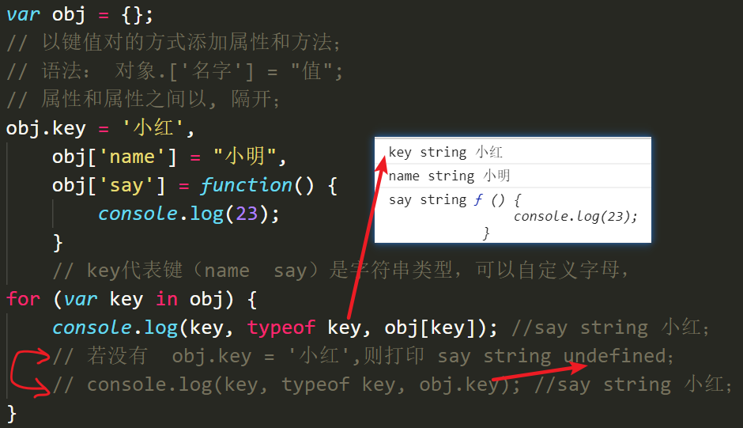

### 往内置对象Math上添加范围随机数:

```js
<script>
        // 需求：获取n-m之间的随机数、n<m；
        // 封装函数；传入形参；设置返回值；
        function f1(n, m) {
            // 定义变量，通过Math方法来获取随机数；
            // Math方法获取随机数；
            // var random_num = Math.random();
            // 先获取0~(m - n + 1)之间范围的数；
            // random_num = Math.random() * (m - n + 1);
            // 因为得到是小数所以要下取整（包含零、包含n）之所以能取到n是因为+1；
            // random_num = Math.floor(Math.random() * (m - n + 1));
            // +n 获取m-n之间的数；
            // var scope = random_num + n;
            // 简写；scope==范围
            var scope = Math.floor(Math.random() * (m - n + 1)) + n;
            // 设置返回值；
            return scope;
        }
        // 往内置对象Math上添加方法；
        Math.f1 = function(n, m) {
                var scope = Math.floor(Math.random() * (m - n + 1)) + n;
                // 设置返回值；
             	// 传入的实参之所以可以随意调换位置，是因为后面加了一个很大的数n,加为正值了；
                return scope;
            }
            // 调用方法并传入实参；
        console.log(Math.f1(80, 50));
    </script>
```

### 小娜v3：

- #### 需注意：

  - if 判断语句里面调用方法，若判断都不成立，则里面的代码不执行；

  - 若要用到上一个判断语句里面的变量，即使是全局变量，若判断都不成立，则代码不执行，里面的变量无法访问；

    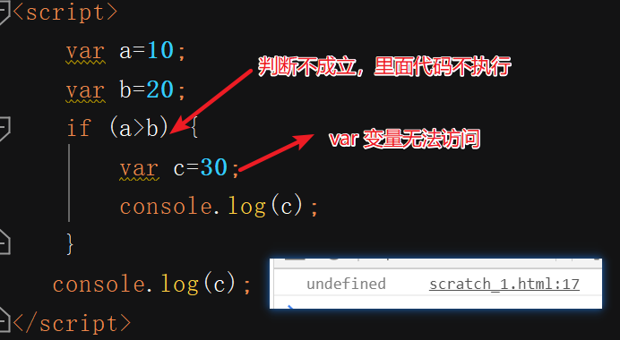

  ### 小娜代码；

```html
 <script>
        // ===================================================封装开始；
        // 封装对象；
        // 注意对象赋值给了变量，所以需要预解析；
        var na = {
                // 封装求和对象；
                "qiuhe": function(sum) {
                    sum = sum.split(',');
                    var he = 0;
                    for (var i = 0; i < sum.length; i++) {
                        he += parseFloat(sum[i]);
                    }
                    return he;
                },
                // 封装日期对象；
                'riqi': function() {
                    var date = new Date();
                    var year = date.getFullYear();
                    var month = date.getMonth() + 1;
                    month = na.youhua(month);
                    var day = date.getDate();
                    day = na.youhua(day);
                    var hour = date.getHours();
                    hour = na.youhua(hour);
                    var minute = date.getMinutes();
                    minute = na.youhua(minute);
                    var second = date.getSeconds();
                    second = na.youhua(second);
                    return `${year}年${month}月${day}日 ${hour}时${minute}分${second}秒`;
                },
                // 封装日期优化 对象；
                'youhua': function(numb) {
                    // 此时的不能给Numb声明并定义变量；
                    // 因为相加的是字符串，传入的有变量；
                    if (numb < 10) {
                        numb = '0' + numb
                    }
                    return numb;
                },
                // 添加数组笑话库属性；
                'storage': [
                    '第一只羊',
                    '第二只羊',
                    '第三只羊',
                    '第四只羊',
                    '第五只羊',
                    '第六只羊',
                    '第七只羊',
                    '第八只羊',
                    '第九只羊',
                    '第十只羊',
                ],
                // 封装随机笑话对象；
                'joke': function(arr) {
                    var arr = arr[Math.floor(Math.random() * arr.length)];
                    return arr;
                }
            }
            // ==========================================================封装结束；
            // 需求：
            /* 
            1、输入q完全退出；
            2、输入1求和；
            3、输入2获取时间；
            4、输入3随机讲一个笑话；
            5、输入4添加一个笑话；
             */
            // 无限循环，弹窗等待用户输入；
            // 判断类型为布尔类型（若输入其他则默认隐式转换为布尔值）；
        while (true) {
            // 声明变量获取用户的输入结果；
            //  \n  为转义字符用于换行；
            var info = prompt('请根据提示输入相关的数字：\n输入q: 完全退出;\n输入1: 求一组数据的和;\n输入2: 获取时间;\n输入3: 随机讲一个笑话;\n输入4添加一个笑话；');
            /* 
            根据用户的输入内容加以判断，
            根据输入的内容的不同来完成不同的功能状态；
            所以用分支语句进行判断；
             */
            //  判断用户输入的内容是否匹配，是则执行代码片段；
            // 输入q完全退出;
            if (info == 'q') {
                alert('你不爱小娜了嘛');
                // 中断当前所在循环体；
                break;
            }
            // 输入1求和
            else if (info == '1') {
                var sum = prompt('请输入一组数字中间以逗号隔开\n例：1,2,3');
                // 对象的调用，需传入参数；
                alert("和为：" + na.qiuhe(sum));
            }
            // 输入2获取时间
            else if (info == '2') {
                // 日期方法的调用；
                alert(na.riqi());
            }
            // 输入3随机讲一个笑话；
            else if (info == '3') {
                // 调用随机笑话方法；
                var arr = na.storage;
                alert(na.joke(arr));
            }
            // 输入4让用户添加笑话；
            else if (info == '4') {
                var add = prompt('请你添加一个笑话：');
                // 对象调用属性（值为数组）得到的是直接就是一个数组；
                // 因为对象是存在堆里面，所以会同步改变；？？？
                // 调用笑话属性库；
                na.storage = na.storage.concat(add);
                // console.log(na.storage); //打印结果为数组；

                // var arr = na.storage;
                // alert(arr[arr.length - 1]);
                // 简写；
                alert(na.storage[na.storage.length - 1]);
            }
            // 以上都不成立则执行以下代码；
            else {
                alert('小娜还小，听不懂你说的是什么，请从新输入');
            }
        }
    </script>
```

### 内存图：

- 简单类型是存在栈上面的；

- 复杂类型是存在堆上面的；

  

##  day6:

### 内置对象：

#### Math：数学对象；

- 方法；

```html
<!DOCTYPE html>
<html lang="en">
<head>
    <meta charset="UTF-8">
    <title>Document</title>
</head>
<body>
    <script>
      //方法直接调用即可；  
        Math.random();//随机数、范围[0-1);
        Math.ceil();//上取整；
        Math.floor();//下取整；
        Math.abs(x);//返回值是x的绝对值；
        Math.round(x);//把x四舍五入取整;
        Math.max(x,y...);//求多个数字中的最大值;
        Math.min(x,y...);//求多个数字中的最小值;
    </script>
</body>
</html>
```

#### Date：日期/时间对象；

```js
// 创建一个日期对象；
var date = new Date(); //直接输出：当前标准时间；
	date.getFullYear()；//年份
    date.getMonth()；//月份 从0开始的；0-11
    date.getDate()；//日
    date.getHours()；//小时； 0-23；
    date.getMinutes()；//分钟；0-59；
    date.getSeconds()；//秒数；0-59；
    date.getMilliseconds()；//毫秒0-999；
// 给一个日期格式字符串；
var date = new Date('2019-01-01');
// 分别传入年月日时分秒。注意传入的月份是从0开始算的
var date = new Date(2019,0,1,12,33,12);

//例：特点获得唯一的数字；
// 获取毫秒数 时间戳
  var date = new Date();
  // 从1970 1 1 到现在的毫秒数
//获取毫秒数的四种方法；
  console.log(date.valueOf());
  console.log(date.getTime());
  console.log(1 * date);
  console.log(Date.now());
  // 要求：绝对的是唯一的数值；
  Math.random() * date.valueOf();
````

#### Array数组对象的方法;

##### push();  把一个元素或多个元素，从数组后面添加进去；

* ```js
  var arr = [1, 2, 3, 4, 5, 6];
     // 参数：添加的数据  中间以 , 隔开；
     // 返回值：添加后的数组的长度；
     var r = arr.push(8, "abc", "789");
     console.log(arr, r);
  ```

  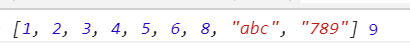

#####  pop(); 直接从后面删除一个元素；

- ```js
  var arr = [1, 2, 3, 4, 5, 6];
     // 返回值：被删除的元素；
  	//可以不传参
     var res = arr.pop();
     console.log(arr, res);
  ```

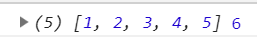

##### shift 直接从前面删除第一个元素；

- ```js
  var arr = ['a', 2, 3, 4, 5, 6];
    // 返回是被删除的元素；
  	//可以不传参
    var res = arr.shift();
    console.log(arr, res);
  ```

  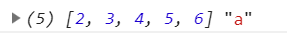

#####  unshift  直接从前面添加一个或多个元素到数组中;

- ```js
  	var arr = [1, 2, 3, 4, 5, 6];
      // 返回值：添加后的数组的长度
      var r = arr.unshift('a', 'b', 'c');
      console.log(arr, r);
  ```

  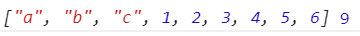

##### splice();从指定位置删除后面指定个数的元素或添加元素；

- 可以进行数组任意位置的增删改；

```js
 	var arr = ['a', 'b', 'c', 'd', 'e'];
    // 1.删除：第一个参数是：第一个要删除元素的下标，第二个参数：要移除的个数‘
    // 2.返回：被删除元素的数组；
    var res = arr.splice(3, 1);//表示：从索引为 3 的地方删除1个字符串 d
    console.log(arr, res);
```

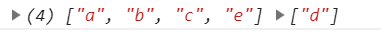

```js
	var arr = ['a', 'b', 'c', 'd', 'e'];
    // 1.第一个参数：第一个要删除元素的下标；
    // 2.第二个参数：删除的个数；
    // 3.后面参数：要添加的元素，从第一个删除的后面添加进去；
    var res = arr.splice(0, 0, 7, 8);
    //返回：被删除元素的数组，若删除元素为零则返回空数组；
    console.log(arr, res);
```

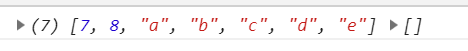

```js
	var arr = ['a', 'b', 'c', 'd', 'e'];
    // 1.第一个参数：开始的下标；
    // 2.第二个参数：删除的个数；
    // 3.后面参数：要添加的数据，从哪开始的下标；
    var res = arr.splice(1, 1, "-----------------");
	//返回：被删除元素的数组，若删除数据为零则返回空数组；
    console.log(arr, res);
```

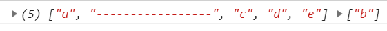

##### 与字符串互转：

###### join 用于将数组中的多元素以指定分隔符连接成一个字符串；

###### split 字符串的方法：转数字，后面为分隔的字符

```js
	var str = '刘备|关羽|张飞';
    // 字符串转数组
    var arr = str.split("|");
    //从数组后面添加一个字符串和数字8进去；
    arr.push("8",8);
    console.log(arr);
    // 数组转字符串
    str = arr.join("-");
    console.log(str);
```

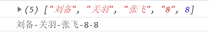

##### 查找元素：

###### indexOf：根据元素查找索引，如果这个元素在数组中，返回索引，否则返回-1，找元素在不在数组内部；

###### lastIndexOf  用法和indexOf一样，只不过是从后面开始找，不常用；

```js
	var arr = [1, 10, 20, 30, 40];
    // 1.查找元素在数组内的下标；
    var res = arr.indexOf(30);
    //  能找到这个元素，返回该元素的下标，找不到返回-1；
    console.log(res);// 打印 3
```

###### findIndex方法用于查找满足条件的第一个元素的索引，如果没有，则返回-1；

```js
 	var arr = [1, 10, 20, 30, 40];
    var res = arr.findIndex(function(item) {
        return item > 50;
    });
    // 把满足条件的第一个元素的的下标返回，如找不到，返回-1；
    console.log(res);//-1
```

###### charAt();这个方法用于获取字符串中位于指定位置的字符；

```js
	var str = '我爱中华人民共和国';
    console.log(str.charAt(2));//中
```

###### charCodeAt(0) 这个方法用于获取字符串中位于指定位置的字符的ASCII码;

```js
	var str = 'abcdef'
    console.log(str.charCodeAt(0));//97
```


##### 遍历数组；

###### for循环遍历数组；

```js
 	var arr = [1, 2, 3, 4, 5, 7, 8, 9, 0];
        for (var i = 0; i <= arr.length - 1; i++) {
            var a = arr[i];
            console.log(a, arr);
        }
```

###### forEach：遍历数组；

- forEach() 方法用于调用数组中的每个元素，并将元素传递给回调函数。

- <b style="color:red">注意: forEach() 对于空数组是不会执行回调函数的。</b>

  

```js
 var arr = [0, 10, 10, 10, 20];
    // forEach 可以用于数组的循环;
    // item 数组的中每个值;
    // index 每个值的下标;
    // arr 当前循环的数组；
    //有返回值，返回值为undefined;
    var sum = 0;
    arr.forEach(function(item, index, arr) {
      //循环遍历结果见下图；
      console.log(item, index, arr);
      sum += item;
    });
    console.log(sum);//50
```

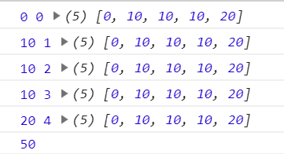
- 例：

  ```js
  <script>
          // 用户会传过来一组数据；
          var str = 'www.cc.com?name="张三"&age=16';
          // 调用函数；
          f1(str);
          console.log(f1(str));
          // 封装函数；传参并设置返回值；
          function f1(str) {
              // 字符串分割去掉 ？前面的地址；
              str = str.split('?');
              // 把数组中的索引为1的字符串重新赋值；
              str = str[1];
              // 把字符串在重新进行分割；
              str = str.split('&');
              // forEach方法 遍历数组；
              // forEach方法需要一个参数是一个函数(回调函数），这个函数也接收3个参数，
              // item是数组中的每个元素，index是item的索引,arr表示当前数组；
              // 对本数组操作，返回值为undefined；
              // 创建一个对象；
              var obj = {}
              str.forEach(function(item, index, arr) {
                  str = item.split('=');
                  // 声明变量接受键和值；
                  // var a = str[0];
                  // var b = str[1];
                  // 把键值对添加到对象中；
                  // 之所以用键值对的方式添加到对象中，是因为得到的a是字符串；
                  // 简写；
                  obj[str[0]] = str[1];
                  // obj[a] = b;
              });
              return obj;
          }
  ```

  

###### filter() 方法创建一个新的数组，新数组中的元素是通过检查指定数组中符合条件的所有元素；

- **注意：** filter() 不会对空数组进行检测。

  **注意：** filter() 不会改变原始数组。

  

- ```js
  var arr = [0, 10, 10, 10, 20];
     // 把数组中 满足某些条件的元素 重新抽取出来，形成一个新的数组；
     var res = arr.filter(function(item, index, arr) {
       return item > 10;
     });
     console.log(arr, res);
  //复制一个数组；条件：item>=0;否则 0 会被判断为false 筛选不出来；
  var arr_1 = arr.filter(function(item,index,arr){
    return item>=0;
  });
  console.log(arr_1);
  ```

  

##### 拼接与截取：

###### concat();拼接数组；从后面往数组里面添加数组并返回新的数组，不会对原数组进行操作；

```js
	var arr1 = [1, 2, 3];
    // 返回添加后的新数组，不会对原数组进行修改；
    var res = arr1.concat([4, 5], [8, 9],1,'a');
    console.log(res, arr1);
```


###### substring 截取字符串，不操作原字符串；返回截取出来的字符串；

```js
 // 这个方法用于获取字符串中的部分字符
    var str = '我爱中华人民共和国';
    // 从索引2开始，到索引4结束，得到之间的字符，不包含索引4的字符
    var res = str.substring(2,4);
    console.log(res);//中华；
```

######  slice();方法从指定位置，截取指定个数的元素；并返回截取元素的新数组；

- 返回是新的数组，不会改变原数组；

```js
 	var arr_2 = ["a", "b", "c", "d"];
    //  第一个参数：开始截取的下标，包括
    //  第二个参数：结束截取的下标，不包括
    var res_2 = arr_2.slice(1, 3);
    console.log(arr_2, res_2);
```


- 如果不给第二个参数，默认就是把从start开始，到length结束的所有的元素截取

- 没有传入参数，则全部截取；

- ```js
    	var arr_2 = ["a", "b", "c", "d",0,'0'];
      // 没有传入参数，全部截取；
      var res_4 = arr_2.slice();
      console.log(arr_2, res_4);//["a", "b", "c", "d",0,'0']
      // 全部截取后的数组和原数组不相等；
      console.log(arr_2==res_4);//false
  ```

  

- slice()可以设置参数为负数，slice()方法在遇到负的参数的时候，会将这个负值与字符串的长度相加。

  ```js
  	var str = '我爱中华人民共和国';
      console.log(str.slice(-6,7));//华人民共
      console.log(str.slice(2,-5));//中华
      console.log(str.slice(-9,-7));//我爱
  ```

  

###### substr(); 这个方法和（substring 截取字符串）效果类似；用于获取字符串中的部分字符；

```js
	var str = '我爱中华人民共和国';
    var res = str.substr(2,2);// 索引2开始，总共获取2个字符，第二个参数为个数
    console.log(res);//中华
```

####  Object 对象：

- 对象的复制；

  ```js
  var obj_1 = {
      a:1,
      b:2
  };
  // 不可以这样；
  var obj_2 = obj_1;
  
  var obj_2 = {}；
  //要通过键值对的方式进行操作；
  for(var key in obj_1){
    obj_2[key] = obj_1[key]
  }
   console.log(obj_2);//{a: 1, b: 2}
   console.log(obj_1==obj_2);//false
  ```

  
