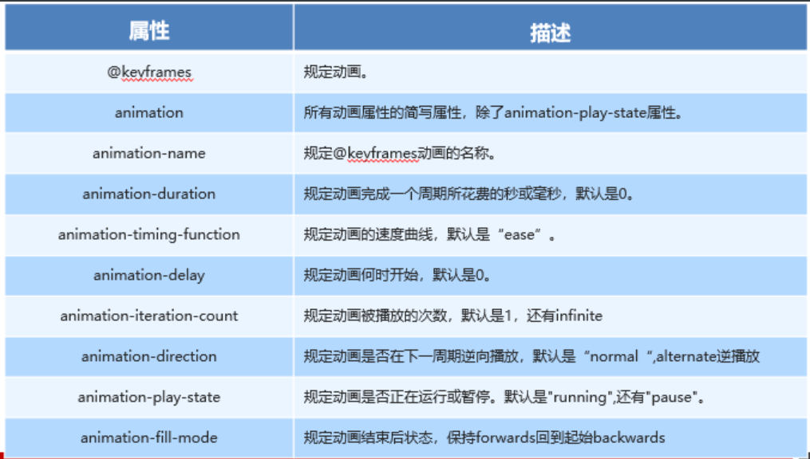
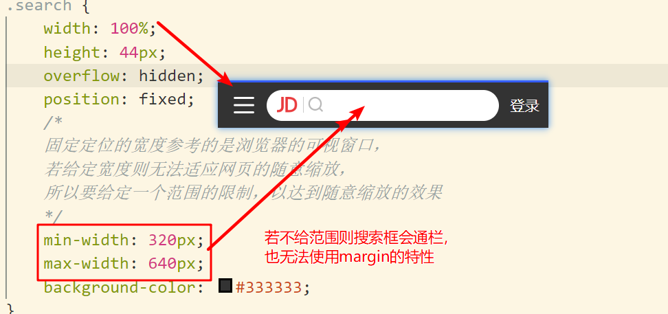

## CSS3：

### 移动：

- 特点：移动不会影响其他盒子的大小；

- 在行内元素无效;

- 重点：会利用移动做居中；

- 需注意先移动在旋转；

  ```html
  
  		div {
              width: 200px;
              height: 200px;
              绝对定位
              position: absolute;
              background-color: magenta;
              利用2D实现盒子居中方案
              left: 50%;
              走自己的一半
              transform: translateX(-50%);
          }
  ```

  

### 旋转：

```css
transform: rotate(45deg);
```

### 缩放：

```css
		长度、宽度方向缩放 
		transform:scale(2,3);
		 长度、宽度方向缩放为同一个比例
		transform:scale(2);
		transform:scale(0.5)
```

### 动画：

- 动画属性：

  

- 定义===调用====时间

- 动画序列：以百分比进行分段，

- 动画从开始执行到经过动画节点，都是基于上一个状态进行变化；

- ```css
  /* 1. 定义动画:*/
  @keyframes dong_hua {
      /* 开始状态:*/
      from {
          transform: translateX(0px);
          background-color: red;
      }
      /* 结束状态 */
      to {
          transform: translateX(1000px);
          background-color: #222;
      }
  }
  
  div {
      /* 2. 调用:*/
      animation-name: move;
      
      /* 3. 时间:*/
      animation-duration: 3s;
  }
  
  /*动画要定义然后给需要的盒子进行调用*/
  		 /*2. 调用*/
  	    animation-name: move;
  	    
  	    /*3. 时间:*/
  	    animation-duration: 3s;
  
  	    animation-delay：动画推迟多久执行；动画的等待。
  	    animation-iteration-count：播放循坏次数 1 2  infinite无限次 
  ```

## 流式布局：

- 又称百分比布局，通过百分比控制盒子的宽度；
- 掌握：会用二倍图，
- 流式布局一般宽度为100%，若不设置高度（高度由内容撑开）；
- 一些小的图标或细线，可以采用伪元素的方式搞定；

### 小节：

​	

## flex布局：

- flex布局主要应用于移动端，对pc端兼容较差；
- flex布局又称：弹性布局、伸缩布局、弹性盒布局、伸缩盒布局；
- flex布局的主要思想是利用行和列进行控制；

### 小结：

- 下方代码中的div和a 会被默认拉伸；

  ```html
  <!doctype html>
  <html lang="en">
  <head>
      <meta charset="UTF-8">
      <meta name="viewport"
            content="width=device-width, user-scalable=no, initial-scale=1.0, maximum-scale=1.0, minimum-scale=1.0">
      <meta http-equiv="X-UA-Compatible" content="ie=edge">
      <title>Document</title>
      <style>
          .w {
              display: flex;
              width: 800px;
              height: 100px;
              border: 1px solid red;
          }
          a {
              width: 100px;
          }
           /* 子元素  */
        /* align-self: auto; 默认值 */
        /* auto :当父亲设置align-items，auto会继承父亲设置的align-items 的值 */
        /* auto: 当父亲没有设置align-items，auto值自动变为拉伸stretch */
        /* align-self: stretch; */
          div {
            /*div给1份，会把元素挤到最右边*/  
              flex: 1;
              border: 1px solid greenyellow;
          }
      </style>
  </head>
  <body>
      <div class='w'>
          <div></div>
          <a href="#"></a>
      </div>
  </body>
  </html>
  ```

  


## rem+媒体查询 布局

### rem单位：

- rem单位：代表HTML的字体大小；
- 1em = 父亲的字体大小px;
- 1rem = HTML 字体大小px；
- 盒子的属性值，用到rem这个单位，那么HTML的字体大小发生改变，整体页面的盒子就会发生等比变化；

### 步骤及注意事项：

- 根据UI的原稿，用flex布局实现1：1（样式用less文件写）；

- 引用css文件；

  

- 引用js文件；

- 把样式中的px值替换成rem单位；

  - 因为网页会有最小和最大的宽度限制，所以要利用"<b>屏幕查询</b>";

    - 要注意权重问题

    - 注意用img的方式插入图片要设置图片的宽度为100%或固定的px值；

    - 用的精灵图要注意？？？？

    - 注意”区间“

    - ```less
      // 确定页面最大-最小范围
      @no: 10;
      @media screen and (max-width: 320px) {
          html {
        //权重提到最高      
              font-size: 320px/@no !important;
          }
      }
      //让屏幕的大小在大于540px范围内，字体固定不变；
      @media screen and (min-width: 540px) {
          html {
              //权重提到最高 
              font-size: 540px/@no !important;
          }
      }
      ```

  - 由于引用的js文件，会把html中的字体大小做限制（不能修改）；所以要加权重；

    ```less
    body {
        width: 540/54rem;
        height: 44/54rem;
        margin: 0 auto;
        background-color: #ccc;
        // 让页面中的字体也一起变化
        font-size: 14/54rem !important;
    }
    ```

    ### 小节：

    - 顶部导航栏由于固定定位，其宽度参考的是浏览器的可视窗口，所以要给定宽度（rem)或宽度范围(flex)；

      ```css
      /*rem布局*/
      header {
          /*此处的宽度是确定的数值，不是百分比*/
        width: 10rem;
        height: 0.81481481rem;
        display: flex;
        position: fixed;
          /*把导航栏定位到浏览器的顶部，防止出现  垂直外边距的合并*/
        top: 0;
        border-top: 0.01851852rem solid #ccc;
        box-sizing: border-box;
        background-color: #fff;
      }
      ```

      流式布局：

      

    - 使用less写样式，注意背景定位的连写时，背景大小推荐分开写；因为会出现编译不出来的情况。

    - 导航栏里面的子元素的宽度可以使用width：百分比或flex：百分比；

      


## 响应式布局

### 挡位划分：

- 屏幕宽大于1200px为大屏，超过1280px需根据公司需求


### 版心：

- 不同的档位下，版心不同；
- 档位设置：版心，<b>container版心是人家给我们预制好的我们拿来用即可；</b>
- 所有的子元素都是归于版心下，不同的版心宽度，意味着子元素要以不同的布局排版满足**用户浏览友好**的需求；
- 注意：
  - 媒体查询使用符号的相关：min-，max-包含等号，后面是数值单位为px；
  - 除超小屏以外：版心的宽度设置都是小于当前档位最小界值，比如 min-width: 768px，版心是750px；原因：两边留空白，用户体验好。
  - **以上市场默认划分，可根据自己需求添加档位；

- ```css
  /* 1. 超小屏幕下 xs  小于 768  布局容器的宽度为 100% */
  @media screen and (max-width: 767px) {
      .container {
          /*此时的版心是100%*/
          width: 100%;
      }
  }
  
  /* 2. 小屏幕下 sm  大于等于768  布局容器改为 750px */
  @media screen and (min-width: 768px) {
      .container {
          width: 750px;
      }
  }
  
  /* 3. 中等屏幕下 md 大于等于 992px   布局容器修改为 970px */
  @media screen and (min-width: 992px) {
      .container {
          width: 970px;
      }
  }
  
  /* 4. 大屏幕下 lg 大于等于1200 布局容器修改为 1170 */
  @media screen and (min-width: 1200px) {
      .container {
          width: 1170px;
      }
  }
  /* 5. 根据公司需求添加其他的挡位*/
  
  
  ```

  

### 布局：

- 原理：媒体查询，内部设置不同的版心和类名；

- 不同挡位下布局不同；

  ```less
  /* md 中屏以上 */
  @media screen and (min-width: 992px) {
        .container {
          width: 970px;
        }
        [class*="col-md-1"] {
          width: 8.333333%;
        }
        [class*="col-md-2"] {
          width: 16.666666%;
        }
        [class*="col-md-3"] {
          width: 25%;
        }
        [class*="col-md-4"] {
          width: 33.3333333%;
        }
        [class*="col-md-5"] {
          width: 41.6666666666%;
        }
        [class*="col-md-6"] {
          width: 50%;
        }
        [class*="col-md-7"] {
          width: 58.33333333333%;
        }
        [class*="col-md-8"] {
          width: 66.66666666666%;
        }
        [class*="col-md-9"] {
          width: 75%;
        }
        [class*="col-md-10"] {
          width: 83.33333333%;
        }
        [class*="col-md-11"] {
          width: 91.66666666%;
        }
        [class*="col-md-12"] {
          width: 100%;
        }
      }
  ```

  

- 多个使用，意味着有多个档位，若当前屏幕属于某个档位，直接该档位类前缀生效；

### bootstrap：

#### 使用初始化：

- index.html 初始化：

  ```html
  <!DOCTYPE html>
  <html lang="zh-CN">
    <head>
      <meta charset="utf-8">
      <!-- 要求 当前网页 使用 IE浏览器 最高版本的内核 来渲染 -->
      <meta http-equiv="X-UA-Compatible" content="IE=edge">
      
      <!-- 视口的设置：视口的宽度和设备一致，默认的缩放比例和PC端一致，用户不能自行缩放 -->
      <meta name="viewport" content="width=device-width, initial-scale=1">
        
      <title>Bootstrap Template</title>
  
      <!-- Bootstrap 的文件引入 已经有初始化文件 Normalize.css-->
      <link href="css/bootstrap.min.css" rel="stylesheet">
  
      <!-- HTML5 shim and Respond.js for IE8 support of HTML5 elements and media queries -->
      <!--解决ie9以下浏览器对html5新增标签的不识别，并导致CSS不起作用的问题-->
      <!--解决ie9以下浏览器对 css3 Media Query  的不识别 -->
      <!-- WARNING: Respond.js doesn't work if you view the page via file:// -->
        
      <!-- 条件注释:小于IE9的版本 -->
      <!--[if lt IE 9]>
        <script src="//cdn.bootcss.com/html5shiv/3.7.2/html5shiv.min.js"></script>
        <script src="//cdn.bootcss.com/respond.js/1.4.2/respond.min.js"></script>
      <![endif]-->
    </head>
    <body>
      <h1>你好，世界！</h1>
    </body>
  </html>
  ```

- 布局容器；

  - .container：设置不同档位下的版心的宽度；
    - 超小屏（xs : extra small）：手机； 0px <=w ；版心宽度为100%
    - 小屏（sm : small） ：平板； 768px<=w  ；版心宽度定为  750px
    - 中屏（md: medium）：桌面；992px<=w ；版心宽度定为  970px
    - 大屏（lg: large）：大桌面；1200px<=w ；版心宽度定为  1170px

  - .container-fluid：百分百宽度；
  - 特点：
    - 所有元素为CSS3盒子模型；
    - 布局盒子有左右15pxpadding值；

- 预制类名：
  - 拿来即用，开袋即食；
  - 修改样式：重新设置类名，注意权重问题；

#### 栅格系统：

​		

- 栅格系统，在各个档位下，控制子元素布局不同；将版心宽度均分为**12份**；
- 各个档位下都有预制好的**类前缀：**


- **类前缀：**
  - 超小屏（xs : extra small）：手机； 
  - 小屏（sm : small） ：平板； 
  - 中屏（md: medium）：桌面；
  - 大屏（lg: large）：大桌面；
- 栅格系统用于通过一系列的**行（row）与列（column）**的组合来创建页面布局，你的内容就可以放入这些创建好的布局中，控制不同的档位下，**列的子元素占有几份**

#### 响应式工具：

- 可以控制子元素在档位下进行显示或隐藏；

  

# 总结：

- 内盒子的左右负外边距值可以抵消父盒子的左右内边距值（css3）；

  ```html
  <!doctype html>
  <html lang="en">
  <head>
      <meta charset="UTF-8">
      <style>
          .e {
              width: 300px;
              height: 300px;
              padding: 0 15px;
              box-sizing: border-box;
              background-color: #FA994D;
          }
          .e div {
              width: 300px;
              height: 100px;
              margin: 0 -15px;
              background-color: #2eaae0;
          }
      </style>
  </head>
  <body>
      <div class='e'>
          <div></div>
      </div>
  </body>
  </html>
  ```

  
