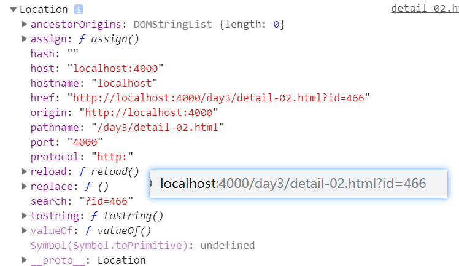
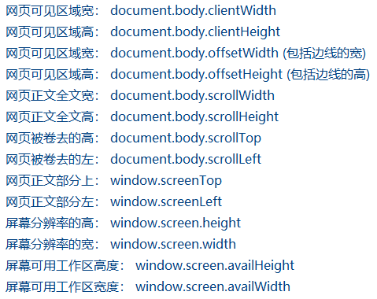

## confirm();

- 弹窗提示，有确定和取消两个按钮；

- 有返回值；布尔类型；

  ```js
  var a=confirm('你确定要删除吗？');
    console.log(a);
  ```

## 获取浏览器的高度；

- ```js
  var docheight=$(window).height();
  console.log(docheight);
  ```

## 获取文档卷曲出去的值；

- ```js
  $(window).scroll(function() {
      var winheight=$(document).scrollTop();
  }
  ```

## 懒加载的实现；

- ```js
    //给window注册滚动事件；
      $(window).scroll(function() {
          //获取浏览器的高度；
      var docheight=$(window).height();
      // console.log(docheight);
      //获取文档的高度；
       var docu=$(document).height();
      // console.log(docu);
      //获取文档卷曲出去的值；
      var winheight=$(document).scrollTop();
          // console.log(winheight);
          // console.log(flag);
          //判断；
          if (docheight+winheight+100>=docu&&falg==true) {
              nam++;
              load();
          }
      })
  ```

## location对象；

- 里面包含所有的浏览器地址栏中的信息；
- 

## `a`标签；

- ```js
  //a标签的默认跳转也属于请求的过程；若不写地址，默认跳转到当前所在页；也可以在链接的后面加请求参数
  <a href="detail-02.html?id=76">View</a>
  ```

## 文件对象；

- 表单控件 file 元素对象，里面有一个属性  files  以数组的形式包含着所有上传的文件对象；

  ```js
   //获取文件对象；
    var fileobj=this.files[0];
  ```

## 内置对象URL；

- 为h5新增的内置对象；

- 可以使用createObjectURL(文件对象)方法，创建一个临时的文件地址；

  ```js
    //创建临时的url地址；
    var url=URL.createObjectURL(fileobj);
  ```

  

## 图片预览；

- input:file 标签属性介绍;

  - accept：限制上传文件的文件类型
    - accept=".jpg,.png,.gif"       一个一个后缀指定
    - accept="image/*"    表示允许任何的图片类型
  - multiple：多选；

  ```js
   <input type="file" id='pic' multiple accept=".jpg,.png,.gif">
       
    $('#pic').change(function () {
        //获取文件对象；注意；是DOM对象；
        const fileobj=this.files[0];
  
        //创建文件临时地址；
        const url=URL.createObjectURL(fileobj);
      })
  
  ```

## iframe;

- 用来嵌入其他的页面；

- 可以嵌入在线的页面也可以嵌入本地页面；

- 若`src`属性值为`#`则默认嵌入当前显示的页面；

- 可以用`a`标签来控制`iframe`来跳转页面；

- 要另外设置`iframe`的`css`属性为`100%`;

  ```js
  <a href="#" target="main_frame"></a>
  <a href="article_list.html" target="main_frame"></a>
  //a标签的target属性要和name属性一样；
  <iframe src="./main_count.html" frameborder="0" name="main_frame"></iframe>
  ```

## 项目基地址；

- 就是配置的地址；

  ```js
  port:8080
  baseUrl:'http://localhost'
  ```

- 那么项目的基地址就是:http://localhost:8080/api/v1;

  - 基地址+端口+/api/vi;

## error;

- 当元素遇到错误（没有正确载入）时，发生 error 事件。

- 当页面的JavaScript发生错误时，window对象会触发error事件;

- 当图像的src属性无效时，比如文件不存在或者图像数据错误时，也会触发图像对象的error事件；

  > 注：由于错误的类型有很多种，所以也可以加判断！

  ```js
   //接收响应；  
    success: function(backData) {
               
     },
    //请求失败后要执行的函数；
    error: function(backData) {
      //错误提示；
      alert('请先登录');
     //判断；
     if (backData.statusText === 'Forbidden') {
         alert('请先登录');
         location.href = './login.html';
     }
    }
  ```

## token;

- 是服务器返回的一个加密的地址==（标识）==；

  - 用于在登录主页时进行判断是否登录用户名和密码；

- 本地缓存：刷新页面数据还在，所以需要本地储存；

  ```js
   // 把token保存到本地；
   localStorage.setItem('token', backData.token);
  ```

- 调用接口时：需要携带在请求头中；

  ```js
  //设置请求头；
  headers: {
  	Authorization: window.localStorage.getItem('token')
  }
  ```

## $.ajaxSetup；

- 设置全局`AJAX`默认选项；

- 例如：请求头；可以设置在里面，这样全部的`$.ajax`请求就都会生效；

- 可以直接写在`jQuery`的源码中；

  - 添加在最下面；

  ```js
  //把请求中的相同的代码写在jQuery的源码中；
  $.ajaxSetup({
      //设置相同的请求头；
      headers: {
          Authorization: window.localStorage.getItem('token')
      },
      //错误处理函数；
      error: function(backData) {
          console.log('我出错啦');
          //判断；
          if (backData.statusText === 'Forbidden') {
              alert('请先登录');
              location.href = './login.html';
          }
      }
  });
  ```

  

## reload();

- 页面刷新；

  ```js
  //页面刷新；
  window.location.reload();
  //获取父元素的window;
  window.parent.location.reload();
  ```

## sessionStorage;

- 和localStorage的区别是：关闭浏览器后数据清空；

- 保存的数据量小；大约`4k`;

  

## 隐藏域；

- 看不到（隐藏起来）的文本框，防止**普通用户**修改；

  

## 查询ip地址；

- window+r    输入cmd     键入：ipconfig

## ajax请求；

- ajax在请求的时候如果不写请求地址，则默认请求当前地址栏的内容==>自己；

## 大小写转换；

### `str.toLowerCase()`；

- 把字符串转换为小写；

### `str.toUpperCase()`；

- 把字符串转换为大写；

## 请求时的缓存问题；

- 验证码在点击刷新的时候，由于每次的请求地址都一样，浏览器会把第一次的请求数据保留，

  当你在次请求时，浏览器便会把上次的保留数据给你；所以导致验证码不会被刷新；

- `解决`：在请求地址的后面加上**随机数**或**时间戳**；

```javascript
//点击刷新验证码；
$(".vcode").click(function () {
	//点击后重新把请求地址设置给src属性；
   $(this).attr('src',`http://localhost:8889/user/captcha?${Date.now()}`)
})
```



## `Object.keys(对象)`

> 概述：取出对象中所有的key值，并以数组的形式返回；

```js
var a = {
	name: '小明',
	age: 18,
	skill: '跳舞'
}

const arr =  Object.keys(a)
console.log(arr); // [ 'name', 'age', 'skill' ]
```

## `fetch()`

>  概述：`XMLHttpRequest`的一种替代方案。除了Ajax获取后台数据之外， **还可以使用一种更优的解决方案fetch** 。

**GET请求及参数传递**

```js
// 通过fetch获取百度的错误提示页面
fetch('https://www.baidu.com/search/error.html?a=1&b=2', { // 在URL中写上传递的参数
    method: 'GET'
  })
  .then((res)=>{
    return res.text()
  })
  .then((res)=>{
    console.log(res)
  })
```

**POST请求及参数传递**

```js
// 通过fetch获取百度的错误提示页面
fetch('https://www.baidu.com/search/error.html', {
    method: 'POST',
    body: new URLSearchParams([["foo", 1],["bar", 2]]).toString() // 这里是请求对象
  })
  .then((res)=>{
    return res.text()
  })
  .then((res)=>{
    console.log(res)
  })
```

**设置请求的头信息**

-  在POST提交的过程中，一般是表单提交，可是发现默认的提交方式是：`Content-Type:text/plain;charset=UTF-8`， 

```js
// 通过fetch获取百度的错误提示页面
fetch('https://www.baidu.com/search/error.html', {
    method: 'POST',
    headers: new Headers({
      'Content-Type': 'application/x-www-form-urlencoded' // 指定提交方式为表单提交
    }),
    body: new URLSearchParams([["foo", 1],["bar", 2]]).toString()
  })
  .then((res)=>{
    return res.text()
  })
  .then((res)=>{
    console.log(res)
  })
```

**通过接口得到`JSON`数据**

```js
fetch('https://www.baidu.com/rec?platform=wise&ms=1&rset=rcmd&word=123&qid=11327900426705455986&rq=123&from=844b&baiduid=A1D0B88941B30028C375C79CE5AC2E5E%3AFG%3D1&tn=&clientWidth=375&t=1506826017369&r=8255', { // 在URL中写上传递的参数
    method: 'GET',
    headers: new Headers({
      'Accept': 'application/json' // 通过头指定，获取的数据类型是JSON
    })
  })
  .then((res)=>{
    return res.json() // 返回一个Promise，可以解析成JSON
  })
  .then((res)=>{
    console.log(res) // 获取JSON数据
  })
```

**强制带Cookie**

-  默认情况下, fetch 不会从服务端发送或接收任何 cookies, 如果站点依赖于维护一个用户会话，则导致未经认证的请求(要发送 cookies，必须发送凭据头). 

```js
// 通过fetch获取百度的错误提示页面
fetch('https://www.baidu.com/search/error.html', {
    method: 'GET',
    credentials: 'include' // 强制加入凭据头
  })
  .then((res)=>{
    return res.text()
  })
  .then((res)=>{
    console.log(res)
  })
```

